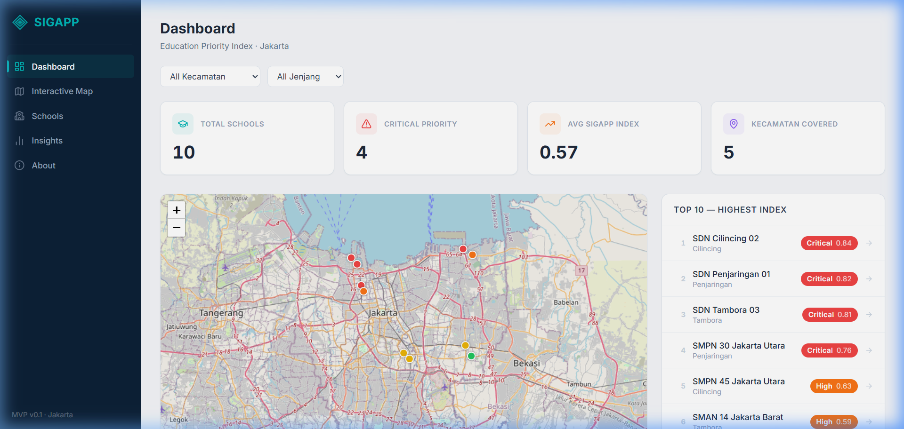

<p align="center">
  <picture>
    <source media="(prefers-color-scheme: dark)" srcset="public/logo-dark-mode-with-texts.png">
    
  </picture>
</p>

<p align="center">
  <strong>Sistem Informasi Geospasial berbasis AI Agentik untuk Perencanaan Pendidikan</strong><br/>
  <em>Geospatial intelligence for school intervention in Jakarta</em>
</p>

<p align="center">
  
  
  
  
  
  
</p>

<p align="center">
  <a href="https://sigapp-dashboard.vercel.app/"><strong>🚀 Live Demo → sigapp-dashboard.vercel.app</strong></a>
</p>

---

## What Is SIGAPP?

SIGAPP is an agentic AI-powered WebGIS decision-support system for educational planning that identifies and prioritizes schools in Jakarta needing immediate intervention. It aggregates structural, academic, spatial, and social data into a composite score — the SIGAPP Index — and surfaces which schools need attention, and why. Built for education planners, government stakeholders, and community partners, SIGAPP moves beyond raw data into targeted, evidence-based action.

---

## Research Context

SIGAPP is developed under **GeoSDS Lab** (Geospatial & Spatial Data Science Laboratory), an independent research lab founded by [Zakiul Fahmi Jailani, MSc](https://github.com/zakiulfahmijailani) at Bakrie University, South Jakarta.

The project addresses a critical gap in Indonesian education planning: the absence of a spatially-aware, data-integrated decision system that can autonomously triage schools and trigger administrative action. SIGAPP combines:

- **PostGIS spatial reasoning** for geographic equity analysis
- **Agentic AI** (ReportAgent + EmailAgent) for autonomous institutional escalation
- **Multi-source data fusion** from Dapodik, Rapor Pendidikan, BPS, and OpenStreetMap

> 📝 A research paper describing the SIGAPP methodology and index is currently in preparation (forthcoming).

---

## The SIGAPP Index

The SIGAPP Index integrates multi-dimensional data into a comprehensive scoring system:

| Pillar | Focus | Weight |
|:---|:---|:---:|
| **P1 — Quality Gap** | Academic disparities: literacy, numeracy, teacher-student ratios | 35% |
| **P2 — Spatial Inequity** | Geographic access barriers: distance, travel time, isolation | 25% |
| **P3 — Structural Risk** | Physical building condition and infrastructure safety | 25% |
| **P4 — Public Signal** | Community complaints, trust deficit, public feedback frequency | 15% |

The dominant pillar — whichever weighs heaviest for a given school — determines the nature of the intervention recommended.

---

## Data Architecture

<p align="center">
  
</p>

The SIGAPP Index is powered by a multi-source data pipeline designed for high-fidelity school analysis. Information flows from national educational databases (Dapodik, Rapor Pendidikan), statistical bureaus (BPS), and geospatial providers (OpenStreetMap, Google Earth Engine) into a granular set of variables. These variables are then aggregated into the four strategic pillars, which finally merge to form the composite SIGAPP Index.

---

## Priority Tiers

| Tier | Label | AI Agents |
|:---|:---|:---:|
| 🔴 **KRITIS** | Critical — highest urgency | ✅ Active |
| 🟠 **TINGGI** | High — approaching critical threshold | ⏳ Standby |
| 🟡 **SEDANG** | Medium — monitored, not urgent | 🔒 Locked |
| 🟢 **NORMAL** | Low — within acceptable range | 🔒 Locked |

Only KRITIS schools activate the full agent layer.

---

## Core Features

**Interactive WebGIS Map** — School locations across Jakarta color-coded by priority tier. Filter by city, education level, and priority status in real time.

**Ranked School List** — Sidebar ranking by SIGAPP Index with smart filtering, skeleton loaders, and search-aware empty states. All active filters sync to URL query params for shareable deep links.

**School Detail Page** — Full pillar breakdown: Sankey diagram, radar chart, narrative summary, and intervention tier badge.

**AI Agent Panel** — For KRITIS-tier schools only:
- ReportAgent: analyzes dominant pillar, writes narrative summary, generates 3 recommendations, exports PDF
- EmailAgent: dispatches report to 5 administrative levels (school → kelurahan → kecamatan → kota → provinsi), tracks reply status, auto-escalates after 48 hours of silence

---

## The Intelligence Layer

When a school crosses into KRITIS, passive monitoring becomes active coordination. The AI agents are the mechanism through which analysis becomes institutional response.

EmailAgent dispatches across the full administrative chain simultaneously and tracks each recipient independently. Every stakeholder’s response — or silence — is visible. Accountability is built into the architecture.

---

## Built With

| Layer | Technology |
|:---|:---|
| Framework | Next.js 14 (App Router) |
| Language | TypeScript 5 |
| Styling | Tailwind CSS |
| Database & Auth | Supabase (PostgreSQL) |
| Mapping | Leaflet.js + OpenStreetMap |
| Charts | Nivo (Sankey), Recharts |
| PDF Export | jsPDF |
| Icons | Lucide React |
| Deployment | Vercel |

---

## Getting Started

```bash
# Clone the repository
git clone https://github.com/zakiulfahmijailani/SIGAPP.git
cd SIGAPP

# Install dependencies
npm install

# Set up environment variables
cp .env.local.example .env.local
# Fill in your Supabase URL, anon key, and other required values

# Run the development server
npm run dev
```

Open [http://localhost:3000](http://localhost:3000) to view the app.

---

## Contributing

Contributions, feedback, and collaborations are welcome — especially from researchers, educators, and GIS practitioners working on education equity or urban data in Indonesia.

**Ways to contribute:**
- 🐛 Report bugs or suggest features via [Issues](https://github.com/zakiulfahmijailani/SIGAPP/issues)
- 🔍 Improve data pipeline or index methodology
- 🇮🇮 Extend coverage beyond Jakarta to other provinces
- 💬 Reach out directly: [zakiul.jailani@bakrie.ac.id](mailto:zakiul.jailani@bakrie.ac.id)

---

## Citation

If you use SIGAPP in your research or reference this system, please cite:

```
Jailani, Z.F. (2026). SIGAPP: Sistem Informasi Geospasial berbasis AI Agentik
untuk Perencanaan Pendidikan. GeoSDS Lab, Bakrie University.
GitHub: https://github.com/zakiulfahmijailani/SIGAPP
```

> A peer-reviewed paper describing the methodology is forthcoming.

---

## Status

SIGAPP is an active research and development project. The SIGAPP Index formula, pillar weights, and agent behavior are under continuous refinement as new school data is integrated and validated.

---

<p align="center">
  <sub>Built for Jakarta’s schools. Grounded in data. Oriented toward equity.</sub>
</p>
